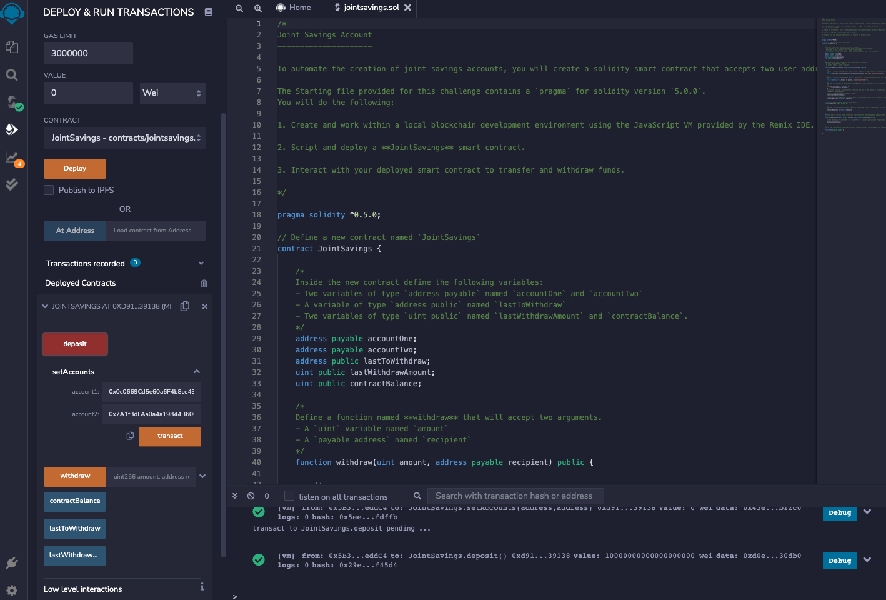
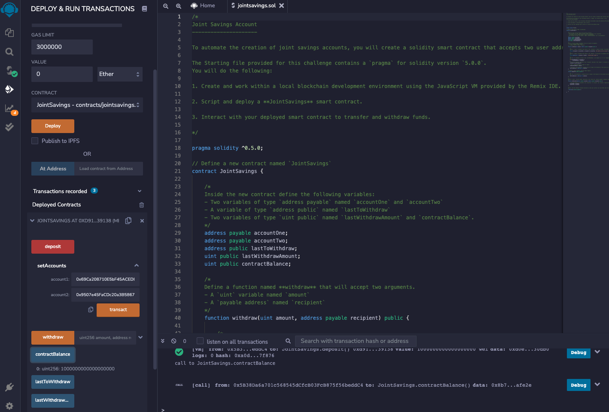
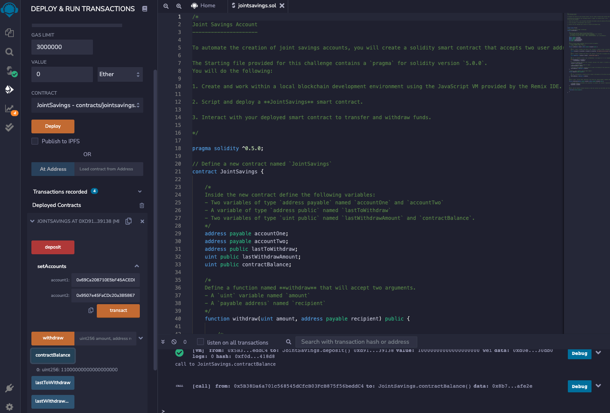
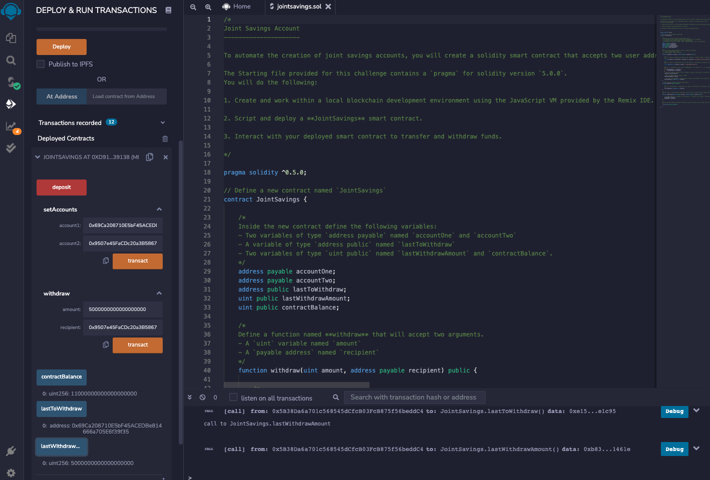
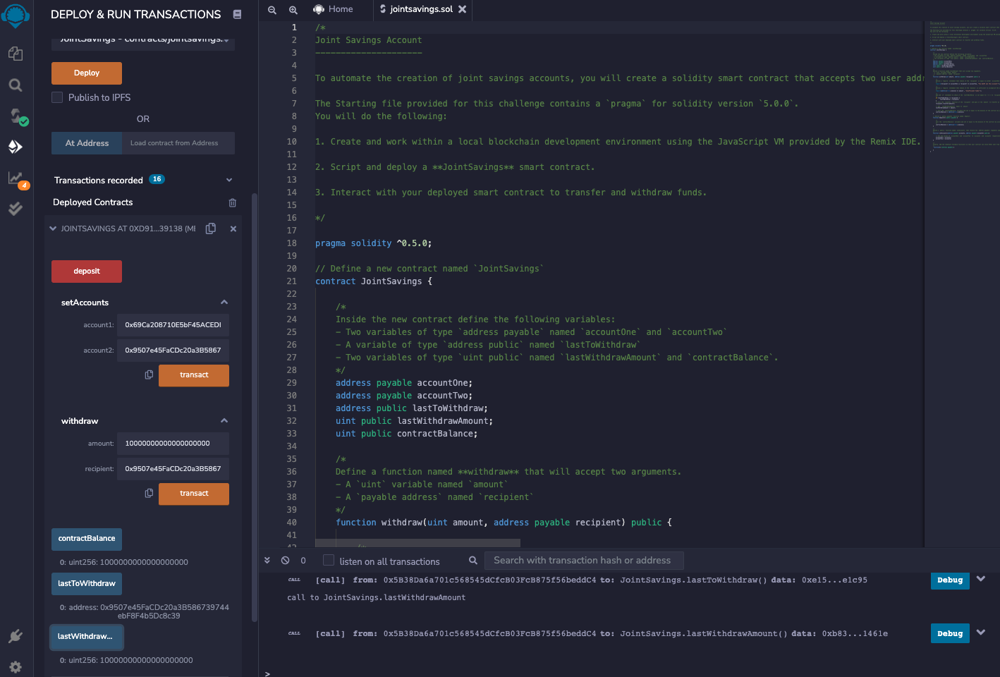

## Fintech Finder

This is a solidity app that sets two account holders and allows deposits and withdrawals to those accounts from the contract wallet account.

---

## Use

First the accounts are set.  Here, dummy accounts are used.

Once the accounts are set, deposits can be made.  Here are deposits of 1, 10, and 5 eth.

Then 5 eth are withdrawn to Account 1 and 10 eth are withdrawn to Account 2.

---

## Contributors

This project was created as a part of the Rice FinTech Bootcamp.

---

## License

This software is licensed for use under the included MIT License.
